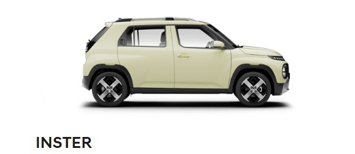

<!DOCTYPE html>
<html>
<body>

  
<h2 align="center"> Welcome! Here are all the cars Hyundai has to offer you.</h2>

<h3 align="left"> SUV</h4>
<h6 align="left"> These range of SUVs are built for durability, preformance and comfort.</h6>

    

<h3>Electfied</h3>
<h6>These cars will help contribute a cleaner tomorrow</h6>

    
   
  

<h3>Small Cars</h3>
<h6 align="left"> Cars for Urban Explorers, every small car available are for fun and zippy for those short drives.

<h3>Performance </h3>
<h6>High performance sports cars kown for it's speedy pleasure.</h6>
